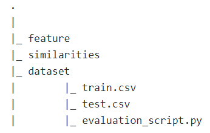

# Oracle Entity Resolution Contest at Polimi
This is our team repository to solve the Entity Resolution Contest hosted by Polimi and Oracle Labs; you can find in depth details [here](https://www.kaggle.com/c/oracle-polimi-contest-2019/overview).

## Getting Started
In this paragraph, we'll see all the steps needed to get the project up and running on your local machine.
### Prerequisites
1. [Python 3.7.4](https://www.python.org/downloads/release/python-374/)
2. Download the data from the [Kaggle Competition page](https://www.kaggle.com/c/oracle-polimi-contest-2019/data)

## How to run
First of all, clone the repo or download and unzip it. Then install the requirements:
```console
foo@bar:~$ <PATH-TO-THE-REPO>pip install requirements.txt
```
After that, you need to create these folders:
<p align="center">

</p>

After that you can choose to run the single modules or, in alternative, we set up a demo that runs all the files necessary to reproduce our best results in the `run_all_model.py` script, so you can simply run:
```console
foo@bar:~$ <PATH-TO-THE-REPO>python run_all_model.py
```
And you will find our 0.55027 score submission.

## Similarity Hybrid
To run the similarity hybrid model that computes the weighted sum of the similarities and creates the submission file, run:
```console
foo@bar:~$ <PATH-TO-THE-REPO>python sym_hybrid.py
```
You can play with the different parameters and similarities. Moreover, you can find all the different kinds of similarities that we tried in the `similarities` folder.

## Neural Network
The NN needs to compute the dataframe of LightGBM through the `create_expanded_dataset.py` script, after that:
```console
foo@bar:~$ <PATH-TO-THE-REPO>python NN.py
```
You can add or remove layers or play with the parameters. This will output a scores_nn.csv file from which you can extract the prediction through the `sub_from_predictions.py` script.
